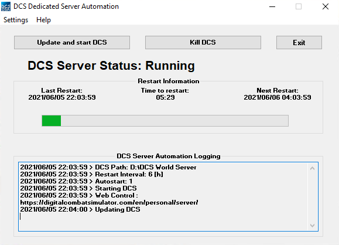

# DCS Dedicated Server Automation

## Install
Just copy exe file anywhere in your computer

## Usage

Define DCS Base dir path in "Settings -> DCS Path"
Define Restart interval in "Settings -> Restart Interval"
You can autorun DCS when application is started

App buttons are self explanatory.

- Button "Update and Start DCS" - App will start DCS_updater.exe
- Button "Kill DCS" - App will kill DCS application

## Example

## TODO (sometime)
- automatic update confirmation
- webhooks
- restful api (maybe)
